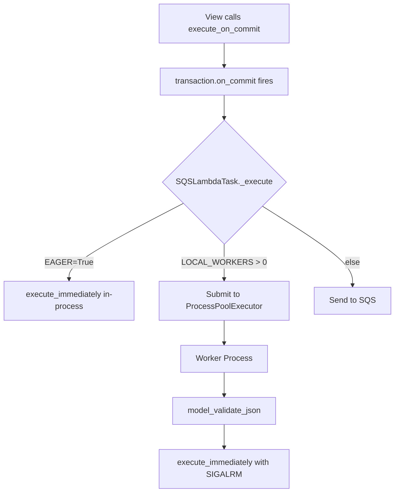

# Design Document: Async Local Execution

## Overview

This feature adds a third execution mode to django-lambda-tasks: **async local mode**. When `LAMBDA_TASKS_LOCAL_WORKERS` is set to a positive integer, tasks are submitted to a `concurrent.futures.ProcessPoolExecutor` instead of SQS. Tasks execute in background worker processes with full timeout enforcement via `SIGALRM`, providing true parallelism without AWS infrastructure.

The execution mode hierarchy becomes:
1. **Eager mode** (`LAMBDA_TASKS_EAGER=True`) — synchronous, in-process, no timeouts
2. **Async local mode** (`LOCAL_WORKERS > 0`) — async, separate processes, timeouts enforced
3. **SQS mode** (default) — async, Lambda workers, timeouts enforced

This is a development-only feature that bridges the gap between eager mode (no parallelism, no timeouts) and full SQS/Lambda deployment.

## Architecture



### Key Design Decisions

1. **ProcessPoolExecutor over multiprocessing.Pool**: `concurrent.futures` provides a cleaner API, automatic worker replacement on crash, and a simpler lifecycle model.

2. **JSON string serialization for IPC**: Rather than relying on pickle for the task message (which would work but couples to internal object layout), we serialize via `model_dump_json()` and deserialize via `model_validate_json()`. This mirrors the SQS path and guarantees picklability since strings are always picklable.

3. **Module-level pool storage**: The pool is stored in a module-level variable so it persists across Django requests for the lifetime of the server process. This avoids repeated process spawning.

4. **Fire-and-forget submission**: The dispatcher discards the `Future` returned by `submit()`. No callbacks, no `result()` calls. Worker failures are isolated and logged within the worker process via the existing `execute_immediately()` error handling.

5. **Pool initializer calls `django.setup()`**: Each worker process needs Django configured. The initializer runs once per worker and sets up Django using the `DJANGO_SETTINGS_MODULE` inherited from the parent process environment.

6. **Timeouts ARE enforced**: Unlike eager mode, async local workers are separate processes where `SIGALRM` works safely. The `TimeoutContext` condition changes from `if not conf.EAGER` to `if not conf.EAGER or conf.LOCAL_WORKERS > 0` — actually, since workers are separate processes that don't have `EAGER=True`, the existing `TimeoutContext` logic works unchanged in worker processes.

## Components and Interfaces

### New Module: `lambda_tasks/local_executor.py`

This module owns the process pool lifecycle and the worker entry point.

```python
"""Process pool executor for async local task execution."""

import uuid
from concurrent.futures import ProcessPoolExecutor

from lambda_tasks.settings import LambdaTasksSettings

# Module-level pool — lazily created, reused for server lifetime
_pool: ProcessPoolExecutor | None = None


def _pool_initializer() -> None:
    """Run once per worker process. Sets up Django."""
    import django
    django.setup()


def get_pool() -> ProcessPoolExecutor:
    """Return the shared ProcessPoolExecutor, creating it on first call."""
    global _pool
    if _pool is None:
        conf = LambdaTasksSettings()
        _pool = ProcessPoolExecutor(
            max_workers=conf.LOCAL_WORKERS,
            initializer=_pool_initializer,
        )
    return _pool


def _execute_in_worker(*, message_json: str, message_id: str) -> None:
    """Worker entry point. Deserializes and executes the task.

    Runs in a child process. Django is already set up via the pool initializer.
    """
    from lambda_tasks.models import SQSLambdaTaskMessage

    message = SQSLambdaTaskMessage.model_validate_json(message_json)
    message.execute_immediately(message_id=message_id)


def submit_task(*, message_json: str) -> None:
    """Submit a task to the process pool. Fire-and-forget."""
    pool = get_pool()
    message_id = str(uuid.uuid4())
    pool.submit(_execute_in_worker, message_json=message_json, message_id=message_id)
```

### Modified: `lambda_tasks/settings.py`

Add the `LOCAL_WORKERS` property with validation:

```python
@property
def LOCAL_WORKERS(self) -> int:
    value = int(getattr(django_settings, "LAMBDA_TASKS_LOCAL_WORKERS", 0))
    if value < 0:
        raise ImproperlyConfigured(
            "LAMBDA_TASKS_LOCAL_WORKERS must be a non-negative integer."
        )
    if value > 0 and self.EAGER:
        raise ImproperlyConfigured(
            "LAMBDA_TASKS_LOCAL_WORKERS and LAMBDA_TASKS_EAGER are mutually exclusive. "
            "Set one or the other, not both."
        )
    return value
```

### Modified: `lambda_tasks/models.py` — `SQSLambdaTask._execute()`

The dispatch logic gains a third branch:

```python
def _execute(self) -> None:
    conf = LambdaTasksSettings()

    if conf.EAGER:
        self.message.execute_immediately(message_id=str(uuid.uuid4()))
    elif conf.LOCAL_WORKERS > 0:
        from lambda_tasks.local_executor import submit_task
        submit_task(message_json=self.message.model_dump_json())
    else:
        # existing SQS path
        ...
```

### Modified: `lambda_tasks/timeouts.py`

No changes needed. The `TimeoutContext` checks `conf.EAGER` to decide whether to arm `SIGALRM`. In worker processes, `EAGER` is `False` (the setting is read from Django settings which are inherited), so timeouts are enforced automatically. The worker processes are separate OS processes where `SIGALRM` is safe to use.

## Data Models

### Settings Model (conceptual)

| Setting | Type | Default | Validation |
|---|---|---|---|
| `LAMBDA_TASKS_LOCAL_WORKERS` | `int` | `0` | Must be ≥ 0; mutually exclusive with `EAGER=True` |

### IPC Data Flow

```
Dispatcher (main process)          Worker Process
─────────────────────────────      ──────────────────────────────
SQSLambdaTaskMessage
  → model_dump_json()
  → JSON string (picklable)
  → submit() via ProcessPool
                                   → _execute_in_worker(message_json=..., message_id=...)
                                   → SQSLambdaTaskMessage.model_validate_json(message_json)
                                   → message.execute_immediately(message_id=message_id)
                                   → TaskRecord created, task runs with SIGALRM
```

### Module-Level State

| Variable | Module | Type | Lifecycle |
|---|---|---|---|
| `_pool` | `local_executor.py` | `ProcessPoolExecutor \| None` | Created on first `submit_task()` call, lives until process exit |

## Correctness Properties

*A property is a characteristic or behavior that should hold true across all valid executions of a system — essentially, a formal statement about what the system should do. Properties serve as the bridge between human-readable specifications and machine-verifiable correctness guarantees.*

### Property 1: Positive LOCAL_WORKERS is preserved

*For any* positive integer `n`, when `LAMBDA_TASKS_LOCAL_WORKERS` is set to `n` and `LAMBDA_TASKS_EAGER` is `False`, the `LambdaTasksSettings().LOCAL_WORKERS` property SHALL return exactly `n`.

**Validates: Requirements 1.1**

### Property 2: Negative LOCAL_WORKERS is rejected

*For any* negative integer `n`, when `LAMBDA_TASKS_LOCAL_WORKERS` is set to `n`, accessing `LambdaTasksSettings().LOCAL_WORKERS` SHALL raise `ImproperlyConfigured`.

**Validates: Requirements 1.3**

### Property 3: Mutual exclusion of EAGER and LOCAL_WORKERS

*For any* positive integer `n`, when both `LAMBDA_TASKS_EAGER` is `True` and `LAMBDA_TASKS_LOCAL_WORKERS` is set to `n`, accessing `LambdaTasksSettings().LOCAL_WORKERS` SHALL raise `ImproperlyConfigured`.

**Validates: Requirements 1.4**

### Property 4: Pool created with correct worker count

*For any* positive integer `n` (within reasonable bounds, e.g. 1–32), when `LOCAL_WORKERS` is `n`, the `ProcessPoolExecutor` created by `get_pool()` SHALL have `_max_workers` equal to `n`.

**Validates: Requirements 2.1**

### Property 5: Async local dispatch routes to pool

*For any* valid `SQSLambdaTaskMessage` and any positive `LOCAL_WORKERS` value, when `EAGER` is `False`, calling `SQSLambdaTask._execute()` SHALL call `ProcessPoolExecutor.submit()` and SHALL NOT call `boto3.client('sqs').send_message()`.

**Validates: Requirements 3.1, 7.2**

### Property 6: Task message serialization round-trip

*For any* valid `SQSLambdaTaskMessage` (with arbitrary `task_name`, `kwargs` containing JSON-serializable values, and non-negative `n_retries`), serializing via `model_dump_json()` and deserializing via `model_validate_json()` SHALL produce an equivalent message object.

**Validates: Requirements 6.1, 6.2, 3.2, 3.3**

## Error Handling

### Configuration Errors (startup time)

| Error Condition | Raised Exception | When |
|---|---|---|
| `LOCAL_WORKERS < 0` | `ImproperlyConfigured` | On first access to `LambdaTasksSettings().LOCAL_WORKERS` |
| `EAGER=True` and `LOCAL_WORKERS > 0` | `ImproperlyConfigured` | On first access to `LambdaTasksSettings().LOCAL_WORKERS` |

### Runtime Errors (task execution)

| Error Condition | Behavior | Impact on Main Process |
|---|---|---|
| Task raises exception | `execute_immediately()` catches it, writes `FAILED` TaskRecord | None — worker is isolated |
| Worker process crashes | `ProcessPoolExecutor` replaces worker automatically | None — pool self-heals |
| Soft timeout exceeded | `SoftTimeLimitExceeded` raised in worker | None — signal is per-process |
| Hard timeout exceeded | `HardTimeLimitExceeded` raised in worker | None — signal is per-process |
| `model_validate_json()` fails | Exception in worker, no TaskRecord written | None — worker is isolated |

### Fire-and-Forget Implications

Since the dispatcher discards the `Future`:
- There is no mechanism to propagate worker exceptions back to the caller
- Failed tasks are only observable via `TaskRecord` entries in the database
- This matches the SQS behavior where the caller never sees task outcomes synchronously

## Testing Strategy

### Property-Based Tests (Hypothesis)

Property-based testing is appropriate for this feature because:
- Settings validation has clear input/output behavior across a range of integers
- Serialization round-trip is a classic PBT pattern
- Dispatch routing is a pure decision based on configuration values

**Library**: `hypothesis` (already in dev dependencies)
**Minimum iterations**: 100 per property test
**Tag format**: `Feature: async-local-execution, Property {number}: {property_text}`

Each correctness property maps to a single `@given`-decorated test function.

### Unit Tests (Example-Based)

| Test | Validates |
|---|---|
| `test_local_workers_default_is_zero` | Req 1.2 |
| `test_pool_reused_across_calls` | Req 2.2 |
| `test_pool_stored_at_module_level` | Req 2.4 |
| `test_dispatcher_does_not_wait_on_future` | Req 3.4, 5.3 |
| `test_eager_mode_with_zero_local_workers` | Req 7.1 |
| `test_sqs_mode_when_local_workers_zero` | Req 7.3 |

### Integration Tests

| Test | Validates |
|---|---|
| `test_pool_initializer_calls_django_setup` | Req 2.3 |
| `test_on_commit_submits_after_transaction` | Req 4.1 |
| `test_rollback_prevents_pool_submission` | Req 4.2 |
| `test_pool_survives_worker_exception` | Req 5.1 |
| `test_pool_replaces_crashed_worker` | Req 5.2 |
| `test_timeout_enforced_in_worker` | Req 8.1, 8.4 |
| `test_soft_timeout_isolated_to_worker` | Req 8.2 |
| `test_hard_timeout_isolated_to_worker` | Req 8.3 |

### Test File Location

All tests go in `tests/test_local_executor.py` following the project convention of one test file per source module.

### Mocking Strategy

- **`ProcessPoolExecutor`**: Mocked in dispatch routing tests to verify `submit()` is called with correct args without spawning real processes
- **`django.setup()`**: Mocked in initializer tests
- **`boto3.client`**: Mocked to verify SQS is NOT called in async local mode
- **Real pool**: Used in integration tests that verify crash isolation and timeout behavior (these tests spawn actual worker processes)
