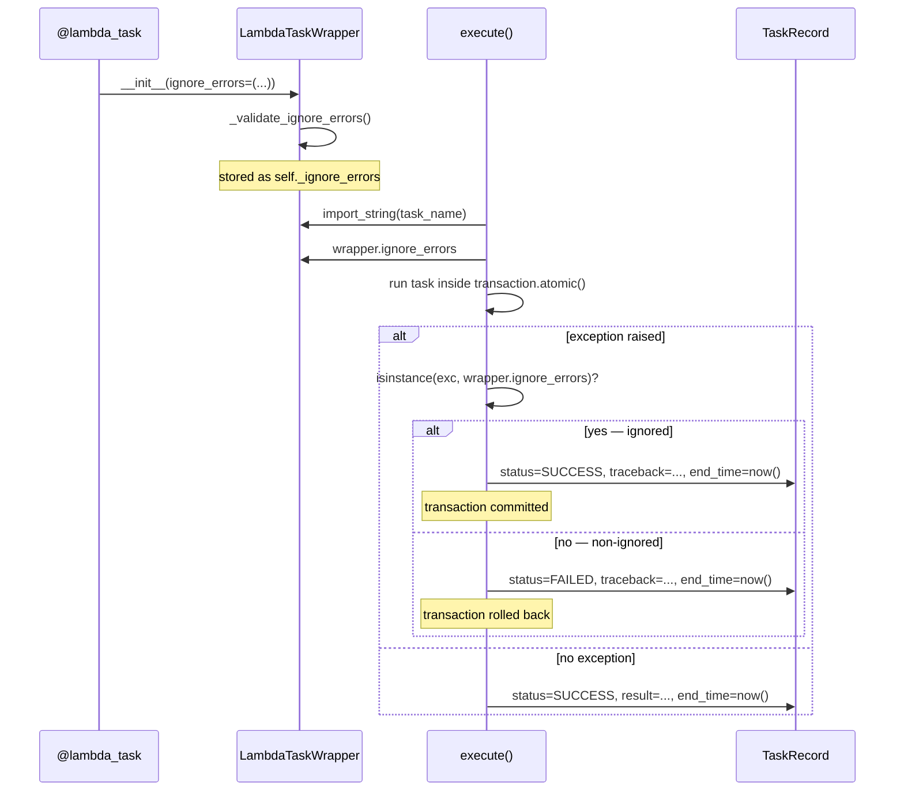

# Design Document: `ignore_errors` Decorator Option

## Overview

This feature adds an `ignore_errors` parameter to `@lambda_task`. When a task raises an exception whose type is a subclass of any type in `ignore_errors`, the executor treats it as a non-fatal outcome: the transaction is committed, the `TaskRecord` is set to `SUCCESS`, and the traceback is recorded for observability. All other exceptions continue to produce `FAILED` with a rollback.

The `ignore_errors` value lives entirely on `LambdaTaskWrapper` — it is never serialised into the SQS message. The executor reads it from the resolved wrapper at execution time, so the SQS message schema is unchanged.

## Architecture

The change touches two modules:

```
decorators.py          models.py
─────────────          ─────────
LambdaTaskWrapper  →   SQSLambdaTaskMessage.execute_immediately()
  ignore_errors            reads wrapper.ignore_errors
  (stored at              after import_string resolution
   decoration time)
```



## Components and Interfaces

### `LambdaTaskWrapper` (`decorators.py`)

**New constructor parameter:**

```python
def __init__(
    self,
    func: Callable[..., Any],
    *,
    delay: int = 0,
    soft_timeout: int | None = None,
    hard_timeout: int | None = None,
    queue: str = "default",
    ignore_errors: tuple[type[BaseException], ...] = (),
) -> None:
```

**New instance attribute:** `self._ignore_errors: tuple[type[BaseException], ...]`

**New property** (read-only access for the executor):

```python
@property
def ignore_errors(self) -> tuple[type[BaseException], ...]:
    return self._ignore_errors
```

**New private validator:**

```python
@staticmethod
def _validate_ignore_errors(
    *, ignore_errors: tuple[type[BaseException], ...]
) -> None:
    """Raise TypeError if any element is not a subclass of BaseException."""
    for item in ignore_errors:
        if not (isinstance(item, type) and issubclass(item, BaseException)):
            raise TypeError(
                f"ignore_errors must contain only exception types (subclasses of "
                f"BaseException); got {item!r}."
            )
```

**`lambda_task` factory** — adds `ignore_errors` to its signature and forwards it:

```python
def lambda_task(
    func=None,
    *,
    delay: int = 0,
    soft_timeout: int | None = None,
    hard_timeout: int | None = None,
    queue: str = "default",
    ignore_errors: tuple[type[BaseException], ...] = (),
) -> ...:
```

### `SQSLambdaTaskMessage.execute_immediately()` (`models.py`)

After resolving the wrapper via `import_string`, the executor reads `wrapper.ignore_errors` and uses it to branch on caught exceptions:

```python
except Exception as error:
if wrapper.ignore_errors and isinstance(error, wrapper.ignore_errors):
    # Non-fatal: commit transaction, record as SUCCESS with traceback
    record.status = TaskRecord.TaskStatus.SUCCESS
    record.traceback = tb_module.format_exc()
    record.end_time = now()
    record.save(update_fields=["status", "traceback", "end_time"])
    task_logger.info(f"Succeeded (ignored {type(error).__name__}) in {record.duration}")
else:
    # Fatal: rollback already happened (atomic block exited via exception)
    record.status = TaskRecord.TaskStatus.FAILED
    record.traceback = tb_module.format_exc()
    record.end_time = now()
    record.save(update_fields=["status", "traceback", "end_time"])
    task_logger.warning(f"Failed in {record.duration}")
```

The key structural change is that the `except` block must be **outside** the `transaction.atomic()` context manager for ignored exceptions to commit. The current code already has the `except` outside the `with transaction.atomic()` block, so the transaction has already been rolled back by the time we reach the `except`. For ignored exceptions we need the transaction to commit instead.

**Revised execution structure:**

```python
ignored_exc: BaseException | None = None

try:
    with transaction.atomic():
        with TimeoutContext(...):
            result = wrapper(**self.kwargs)
except Exception as error:
    if wrapper.ignore_errors and isinstance(error, wrapper.ignore_errors):
        ignored_exc = error
    else:
        # non-ignored: atomic already rolled back
        record.status = TaskRecord.TaskStatus.FAILED
        record.traceback = tb_module.format_exc()
        record.end_time = now()
        record.save(update_fields=["status", "traceback", "end_time"])
        task_logger.warning(f"Failed in {record.duration}")
        return  # or use else branch

if ignored_exc is None:
    # clean success
    record.status = TaskRecord.TaskStatus.SUCCESS
    record.result = result
    record.end_time = now()
    record.save(update_fields=["status", "result", "end_time"])
    task_logger.info(f"Succeeded in {record.duration}")
else:
    # ignored exception: transaction was rolled back by atomic(), but we
    # need to commit the TaskRecord update outside any atomic block
    record.status = TaskRecord.TaskStatus.SUCCESS
    record.traceback = tb_module.format_exc()
    record.end_time = now()
    record.save(update_fields=["status", "traceback", "end_time"])
    task_logger.info(f"Succeeded (ignored {type(ignored_exc).__name__}) in {record.duration}")
```

> **Design decision — transaction semantics for ignored exceptions:**
> When an ignored exception is raised, `transaction.atomic()` exits via exception and rolls back the savepoint/transaction. The `TaskRecord` save for the SUCCESS outcome happens *after* the atomic block exits, so it is committed in the outer (autocommit) context. This means any ORM writes the task made inside the atomic block are rolled back, but the `TaskRecord` itself is committed. This is consistent with the FAILED path and is the correct behaviour: the task's side-effects are not persisted, but the record of the outcome is.

### `SQSLambdaTaskMessage` model — no changes

`ignore_errors` is intentionally absent from `SQSLambdaTaskMessage`. It is resolved from the wrapper at execution time. This keeps the SQS message schema stable and avoids any version-skew issues between message producers and consumers.

## Data Models

No new database fields or migrations are required. The existing `TaskRecord.traceback` field (nullable `TextField`) is reused to store the ignored exception's traceback.

`LambdaTaskWrapper` gains one new in-memory attribute:

| Attribute | Type | Default | Description |
|---|---|---|---|
| `_ignore_errors` | `tuple[type[BaseException], ...]` | `()` | Exception types to treat as non-fatal |

## Correctness Properties

*A property is a characteristic or behavior that should hold true across all valid executions of a system — essentially, a formal statement about what the system should do. Properties serve as the bridge between human-readable specifications and machine-verifiable correctness guarantees.*

### Property 1: `ignore_errors` round-trip on `LambdaTaskWrapper`

*For any* tuple of exception types passed as `ignore_errors` to `LambdaTaskWrapper`, the wrapper's `ignore_errors` property should return an equal tuple.

**Validates: Requirements 1.1, 1.3**

---

### Property 2: Non-exception types in `ignore_errors` are rejected at decoration time

*For any* value that is not a subclass of `BaseException`, passing it inside `ignore_errors` to `LambdaTaskWrapper` (or `lambda_task`) should raise `TypeError`.

**Validates: Requirements 1.4**

---

### Property 3: Ignored exception produces SUCCESS with traceback and end_time

*For any* exception type `E` in `ignore_errors`, when a task raises an instance of `E`, the resulting `TaskRecord` should have `status=SUCCESS`, a non-null `traceback` containing the exception class name, and a non-null `end_time`.

**Validates: Requirements 2.1, 2.3, 2.4, 5.1**

---

### Property 4: Ignored exception commits the transaction (task-side ORM writes are rolled back, record is committed)

*For any* exception type `E` in `ignore_errors`, when a task makes ORM writes and then raises `E`, those task-side ORM writes should not be visible after execution, but the `TaskRecord` itself should be committed with `status=SUCCESS`.

**Validates: Requirements 2.2**

---

### Property 5: Subclass of ignored exception type is also ignored

*For any* base exception type `B` in `ignore_errors` and any subclass `S` of `B`, when a task raises an instance of `S`, the `TaskRecord` should have `status=SUCCESS`.

**Validates: Requirements 2.5**

---

### Property 6: Non-ignored exception produces FAILED with rollback

*For any* exception type `E` not in `ignore_errors`, when a task raises an instance of `E`, the resulting `TaskRecord` should have `status=FAILED`, task-side ORM writes should be rolled back, and the traceback should be non-null.

**Validates: Requirements 3.1, 3.2, 3.3, 3.4**

---

### Property 7: Eager mode applies the same `ignore_errors` logic

*For any* exception type `E` in `ignore_errors`, when a task is executed in eager mode (`LAMBDA_TASKS_EAGER=True`) and raises `E`, the resulting `TaskRecord` should have `status=SUCCESS` — identical to Lambda execution mode.

**Validates: Requirements 4.3**

---

## Error Handling

| Scenario | Behaviour |
|---|---|
| `ignore_errors` contains a non-type value (e.g. an instance) | `TypeError` raised at decoration time in `_validate_ignore_errors` |
| `ignore_errors` contains a type that is not a `BaseException` subclass | `TypeError` raised at decoration time |
| `ignore_errors` is omitted | Defaults to `()` — all exceptions cause `FAILED` (existing behaviour) |
| Ignored exception raised inside `transaction.atomic()` | Atomic block rolls back task-side writes; `TaskRecord` save happens outside atomic, so it commits |
| Non-ignored exception raised | Existing rollback + `FAILED` path, unchanged |
| `wrapper.ignore_errors` is `()` at execution time | `isinstance(exc, ())` is always `False` — fast path, no behaviour change |

## Testing Strategy

Tests live in `tests/test_decorator.py` (decorator-level) and `tests/test_models.py` (executor-level), following the existing one-file-per-module convention.

**Unit tests** cover:
- `LambdaTaskWrapper` constructed with `ignore_errors=()` has the attribute set to `()`
- `lambda_task(ignore_errors=(ValueError,))` forwards the parameter correctly
- `SQSLambdaTaskMessage` has no `ignore_errors` field
- Clean success path: `traceback` remains `None` (existing behaviour, regression guard)
- Non-ignored exception path: `FAILED` + rollback (existing behaviour, regression guard)

**Property-based tests** use [Hypothesis](https://hypothesis.readthedocs.io/) (already present in the project). Each property test runs a minimum of 100 iterations.

| Test | Property | Tag |
|---|---|---|
| `test_property_ignore_errors_round_trip` | Property 1 | `Feature: ignore-errors-decorator-option, Property 1` |
| `test_property_non_exception_type_rejected` | Property 2 | `Feature: ignore-errors-decorator-option, Property 2` |
| `test_property_ignored_exc_produces_success` | Property 3 | `Feature: ignore-errors-decorator-option, Property 3` |
| `test_property_ignored_exc_commits_record` | Property 4 | `Feature: ignore-errors-decorator-option, Property 4` |
| `test_property_subclass_of_ignored_is_ignored` | Property 5 | `Feature: ignore-errors-decorator-option, Property 5` |
| `test_property_non_ignored_exc_produces_failed` | Property 6 | `Feature: ignore-errors-decorator-option, Property 6` |
| `test_property_eager_mode_ignore_errors_parity` | Property 7 | `Feature: ignore-errors-decorator-option, Property 7` |

Each property-based test must include a comment in the format:
```python
# Feature: ignore-errors-decorator-option, Property N: <property text>
```

Hypothesis strategies to use:
- Exception type generation: `st.sampled_from([ValueError, RuntimeError, KeyError, TypeError, OSError, AttributeError])` for concrete types; subclass testing uses dynamically created subclasses via `type("Sub", (base,), {})`
- `ignore_errors` tuples: `st.lists(st.sampled_from([...]), min_size=1, max_size=3).map(tuple)`
- Non-exception-type values: `st.one_of(st.integers(), st.text(), st.none(), st.booleans(), st.just(object))`
