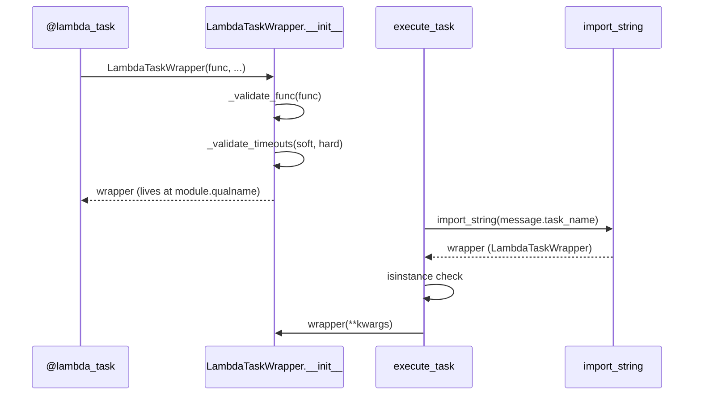

# Design Document: import-string-task-resolution

## Overview

This refactor removes the global task registry (`registry.py`) and moves validation into `LambdaTaskWrapper.__init__`. The two changes are independent but ship together because they both simplify the library's internal contract.

**Refactor 1 — import_string resolution**: `execute_task` currently calls `registry.get(name=message.task_name)` to look up the wrapper. After this change it will call `django.utils.module_loading.import_string(message.task_name)` instead. Because `task_name` is already the fully-qualified dotted path (`module.qualname`) of the decorated function, `import_string` resolves directly to the `LambdaTaskWrapper` object that lives at that path in the module's namespace — no pre-registration step required.

**Refactor 2 — validation in `__init__`**: `_validate_func` and `_validate_timeouts` are currently called only inside the `lambda_task` decorator factory. A user who constructs `LambdaTaskWrapper(bad_func, soft_timeout=999)` directly bypasses all validation. Moving the calls into `__init__` closes that gap.

Neither change affects the public API seen by task authors.

## Architecture

The current data flow:

```
@lambda_task → registry.register() → [registry dict]
execute_task()   → registry.get()      → wrapper → call
```

After the refactor:

```
@lambda_task → LambdaTaskWrapper.__init__ (validates) → wrapper lives at module.qualname
execute_task()   → import_string(task_name)                   → wrapper → call
```

`registry.py` is deleted entirely. `handler.py` loses its `from lambda_tasks import registry` import.



## Components and Interfaces

### `lambda_tasks/decorators.py`

**`LambdaTaskWrapper.__init__`** gains two validation calls:

```python
def __init__(self, func, *, delay=0, soft_timeout=None, hard_timeout=None, queue="default"):
    _validate_func(func=func)
    _validate_timeouts(soft_timeout=soft_timeout, hard_timeout=hard_timeout)
    functools.update_wrapper(self, func)
    ...
```

`_validate_func` and `_validate_timeouts` remain as module-level helpers (unchanged logic). The `lambda_task` decorator factory's `_decorate` inner function drops its explicit calls to those helpers and drops the `registry.register(...)` call — it simply constructs and returns the wrapper.

### `lambda_tasks/executor.py`

`execute_task` replaces the registry lookup with `import_string`:

```python
from django.utils.module_loading import import_string
from lambda_tasks.decorators import LambdaTaskWrapper

wrapper = import_string(message.task_name)
if not isinstance(wrapper, LambdaTaskWrapper):
    raise TypeError(
        f"import_string('{message.task_name}') returned {type(wrapper)!r}, "
        f"expected LambdaTaskWrapper."
    )
```

The `from lambda_tasks import registry` import is removed. No `TaskRecord` is created before the `import_string` call, so an `ImportError` propagates cleanly without leaving a dangling record.

### `lambda_tasks/handler.py`

Remove the `from lambda_tasks import registry` import. No other changes — `execute_task` handles resolution internally.

### `lambda_tasks/registry.py`

Deleted.

## Data Models

No model changes. `SQSLambdaTaskMessage.task_name` continues to hold the `module.qualname` dotted path, which is exactly what `import_string` expects.

The invariant that makes `import_string` work: when `@lambda_task` decorates a module-level function `f` in `myapp.tasks`, the decorator replaces the name `f` in that module's namespace with the `LambdaTaskWrapper` instance. So `import_string("myapp.tasks.f")` returns the wrapper, not the original function.

This invariant holds for module-level functions. It does **not** hold for locally-defined functions (e.g. functions defined inside a test body). Those are already unsupported for production use — they cannot be resolved by any import mechanism — and the existing tests that define tasks locally already register them manually. After this refactor those tests will need to be updated to either use module-level tasks or patch `import_string`.

## Correctness Properties


*A property is a characteristic or behavior that should hold true across all valid executions of a system — essentially, a formal statement about what the system should do. Properties serve as the bridge between human-readable specifications and machine-verifiable correctness guarantees.*

### Property 1: import_string round-trip

*For any* module-level function decorated with `@lambda_task`, calling `import_string(task_name)` where `task_name` is the `module.qualname` of that function should return the same `LambdaTaskWrapper` instance that the decorator produced.

**Validates: Requirements 1.1, 5.4**

### Property 2: ImportError propagates without creating a TaskRecord

*For any* `task_name` string that cannot be resolved by `import_string` (raises `ImportError`), calling `execute_task` with that name should propagate the `ImportError` to the caller and leave no `TaskRecord` in the database.

**Validates: Requirements 1.2**

### Property 3: Non-wrapper return raises TypeError

*For any* object that is not a `LambdaTaskWrapper` instance, if `import_string` returns that object, `execute_task` should raise `TypeError` with a descriptive message.

**Validates: Requirements 1.5**

### Property 4: Deleted registry raises ImportError

*For any* attempt to `import lambda_tasks.registry` after the file is deleted, Python should raise `ImportError` (i.e. the module no longer exists).

**Validates: Requirements 2.1**

### Property 5: Positional-parameter functions rejected at construction

*For any* function that has one or more positional (non-keyword-only) parameters, constructing `LambdaTaskWrapper(func)` should raise `TypeError` identifying the offending parameter.

**Validates: Requirements 3.1**

### Property 6: Underscore-prefixed parameters rejected at construction

*For any* function that has a parameter whose name starts with `_`, constructing `LambdaTaskWrapper(func)` should raise `TypeError` identifying the offending parameter.

**Validates: Requirements 3.2**

### Property 7: Invalid timeout configuration rejected at construction

*For any* combination of `soft_timeout` and `hard_timeout` values where either exceeds 900 or `soft_timeout >= hard_timeout` (when both are non-`None`), constructing `LambdaTaskWrapper(func, soft_timeout=..., hard_timeout=...)` should raise `ConfigurationError`.

**Validates: Requirements 3.3, 3.4, 3.5**

### Property 8: Valid inputs produce a correctly-attributed wrapper

*For any* valid keyword-only function and valid timeout pair (both ≤ 900, `soft < hard` when both set), `LambdaTaskWrapper(func, ...)` should construct without raising and the resulting wrapper should expose `__call__`, `on_commit`, `__name__`, `__doc__`, and `__wrapped__` with `__wrapped__` being the original function.

**Validates: Requirements 3.6, 5.1**

## Error Handling

| Scenario | Current behaviour | New behaviour |
|---|---|---|
| `task_name` not importable | `KeyError` from registry dict | `ImportError` propagated from `import_string`; no `TaskRecord` created |
| `import_string` returns non-wrapper | Not possible (registry only stores wrappers) | `TypeError` raised before `TaskRecord` is created |
| Positional-param func passed to `LambdaTaskWrapper` directly | No error (validation skipped) | `TypeError` raised in `__init__` |
| Invalid timeouts passed to `LambdaTaskWrapper` directly | No error (validation skipped) | `ConfigurationError` raised in `__init__` |

The ordering in `execute_task` is important: `import_string` is called **before** `TaskRecord.objects.create`. This ensures that resolution failures leave no dangling records.

## Testing Strategy

### Unit tests

Focus on specific examples and error conditions:

- `execute_task` with a patched `import_string` that returns a valid wrapper → task runs, `TaskRecord` created.
- `execute_task` with `import_string` patched to raise `ImportError` → exception propagates, no `TaskRecord`.
- `execute_task` with `import_string` returning a plain function (not a wrapper) → `TypeError` raised.
- `LambdaTaskWrapper(positional_func)` → `TypeError`.
- `LambdaTaskWrapper(underscore_param_func)` → `TypeError`.
- `LambdaTaskWrapper(func, soft_timeout=100, hard_timeout=50)` → `ConfigurationError`.
- `import lambda_tasks.registry` → `ImportError` (file deleted).
- Existing tests that reference `registry` directly must be updated to remove those references.

### Property-based tests

Use `hypothesis` for universal coverage. Each property test runs a minimum of 100 iterations.

**Tag format**: `# Feature: import-string-task-resolution, Property {N}: {property_text}`

| Property | Test description | Hypothesis strategy |
|---|---|---|
| P1: import_string round-trip | For any module-level `@lambda_task` function, `import_string(task_name)` returns the wrapper | Fixed set of module-level tasks (import_string requires real module paths) — use example-based test |
| P2: ImportError propagates | For any unresolvable task_name, no TaskRecord is created | `st.text()` filtered to strings that are not valid dotted paths |
| P3: Non-wrapper → TypeError | For any non-LambdaTaskWrapper object returned by import_string | `st.one_of(st.integers(), st.text(), st.none(), st.functions())` |
| P5: Positional params rejected | For any n ≥ 1 positional params, `LambdaTaskWrapper` raises `TypeError` | `st.integers(min_value=1, max_value=5)` → dynamically built functions |
| P6: Underscore params rejected | For any function with `_`-prefixed kwonly param, raises `TypeError` | `st.text(min_size=1)` prefixed with `_` |
| P7: Invalid timeouts rejected | For any (soft, hard) where soft ≥ hard or either > 900, raises `ConfigurationError` | `st.integers()` pairs covering all invalid regions |
| P8: Valid inputs succeed | For any valid (func, soft, hard), wrapper has correct attributes | `st.integers(1, 899)` pairs with soft < hard |

Property P4 (registry deletion) is verified as a single example test — it is a one-time structural assertion, not a universally-quantified property over inputs.

Both unit tests and property tests are complementary: unit tests catch concrete bugs at specific inputs; property tests verify general correctness across the input space.
