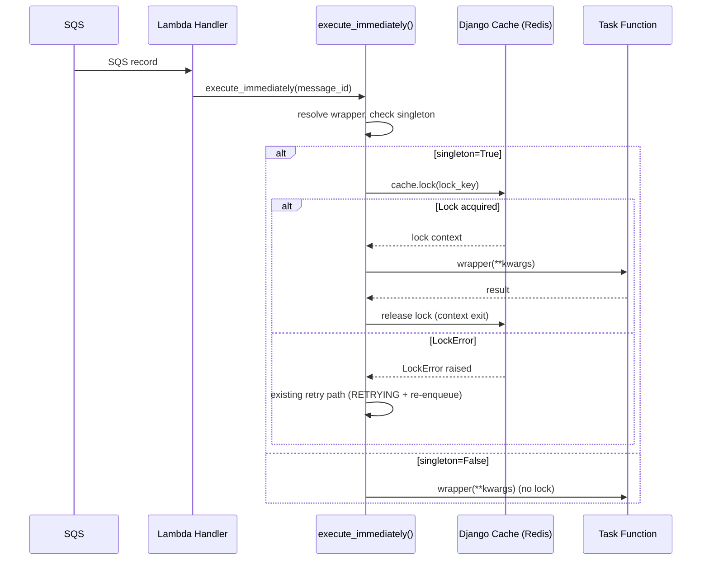

# Design Document: Singleton Task

## Overview

This feature adds a `singleton=True` option to the `@lambda_task` decorator that prevents concurrent execution of the same task. When enabled, the executor acquires a Redis lock via Django's cache framework before running the task function. If the lock cannot be acquired (another instance is already running), the task is retried using the existing `retry_on` code path — `LockError` is treated as a retryable exception, the `TaskRecord` is set to `RETRYING`, the traceback is recorded, and the task is re-enqueued via `execute_on_commit` with an incremented `n_retries`.

The singleton option is a decorator-level concern only — it is not serialized into the SQS message, consistent with how `ignore_errors` and `retry_on` are handled.

## Architecture



The design reuses the existing retry mechanism in `execute_immediately()`. The key insight is that `LockError` is handled identically to any exception in `retry_on` — the same code path that catches retryable exceptions, sets status to `RETRYING`, records the traceback, and re-enqueues via `execute_on_commit` with incremented `n_retries`.

### Design Decisions

1. **Reuse existing retry path for lock contention**: Rather than implementing a separate retry flow for `LockError`, we prepend `LockError` to the effective `retry_on` tuple when `singleton=True`. This means the existing `retry_on` branch in `execute_immediately()` handles lock contention automatically — same status tracking, same traceback recording, same re-enqueue logic, same `MAX_RETRIES` enforcement.

2. **Lock wraps the atomic block**: The singleton lock is acquired before `transaction.atomic()` and released after it. This ensures the lock is held for the entire duration of the task execution including the database transaction, preventing any window where two instances could overlap.

3. **Lock acquired in executor, not decorator**: The lock is acquired in `execute_immediately()` (the executor), not in the decorator's `__call__`. This keeps the singleton concern at the execution layer where retry logic already lives, and avoids affecting direct synchronous calls.

4. **`SINGLETON_CACHE` setting with `"default"` fallback**: A dedicated setting allows operators to point singleton locks at a specific Redis instance without affecting other cache usage.

## Components and Interfaces

### Modified: `LambdaTaskWrapper` (decorators.py)

New constructor parameter and property:

```python
def __init__(
    self,
    func: types.FunctionType,
    *,
    # ... existing params ...
    singleton: bool = False,
) -> None:
```

- `singleton` property: `bool` — exposes the stored value
- No new validation needed — it's a simple boolean with a default of `False`

### Modified: `lambda_task` decorator factory (decorators.py)

Accepts and forwards `singleton` kwarg to `LambdaTaskWrapper`.

### Modified: `SQSLambdaTaskMessage.execute_immediately()` (models.py)

When `wrapper.singleton` is `True`:

1. Retrieve the cache backend via `caches[LambdaTasksSettings().SINGLETON_CACHE]`
2. Compute lock key: `f"lambda_tasks.singleton_lock.{self.task_name}"`
3. Acquire the lock via `cache.lock(lock_key, blocking_timeout=0, timeout=hard_timeout)` — `blocking_timeout=0` fails immediately if the lock is held (no point blocking in a Lambda invocation), `timeout=hard_timeout` auto-expires the lock if the worker crashes
4. Wrap the existing `transaction.atomic()` + `TimeoutContext` block inside the lock context manager
5. If `LockError` is raised, it falls through to the existing `retry_on` handling because we prepend `LockError` to the effective retry tuple

The effective retry tuple is computed as:

```python
effective_retry_on = wrapper.retry_on
if wrapper.singleton:
    effective_retry_on = (LockError, *wrapper.retry_on)
```

This is used in the existing `isinstance(error, ...)` check instead of `wrapper.retry_on` directly.

### Modified: `LambdaTasksSettings` (settings.py)

New property:

```python
@property
def SINGLETON_CACHE(self) -> str:
    return str(getattr(django_settings, "LAMBDA_TASKS_SINGLETON_CACHE", "default"))
```

### Unchanged: `SQSLambdaTaskMessage` schema

The `singleton` value is NOT added to the Pydantic model. It is read from the resolved `LambdaTaskWrapper` at execution time, consistent with `ignore_errors` and `retry_on`.

## Data Models

### No schema changes

The `SQSLambdaTaskMessage` Pydantic model and `TaskRecord` Django model remain unchanged. The `singleton` flag is stored only on `LambdaTaskWrapper` instances.

### Lock key format

```
lambda_tasks.singleton_lock.{task_name}
```

Where `task_name` is the fully-qualified dotted path (e.g. `myapp.tasks.sync_data`).


## Correctness Properties

*A property is a characteristic or behavior that should hold true across all valid executions of a system — essentially, a formal statement about what the system should do. Properties serve as the bridge between human-readable specifications and machine-verifiable correctness guarantees.*

### Property 1: Singleton storage round-trip

*For any* boolean value `b`, constructing a `LambdaTaskWrapper` with `singleton=b` and reading `wrapper.singleton` should return `b`.

**Validates: Requirements 1.1, 1.2**

### Property 2: Lock key format

*For any* task name string, when a singleton task is executed, the executor should attempt to acquire a lock with key `lambda_tasks.singleton_lock.{task_name}`.

**Validates: Requirements 2.1**

### Property 3: Lock release on success and failure

*For any* singleton task execution that either succeeds or raises an exception (other than `LockError`), the lock context manager should be properly exited (lock released).

**Validates: Requirements 2.2, 2.3**

### Property 4: LockError triggers retry with RETRYING status and incremented n_retries

*For any* singleton task where `LockError` is raised and `n_retries < MAX_RETRIES`, the executor should set the `TaskRecord` status to `RETRYING`, record a traceback containing "LockError", and re-enqueue the task with `n_retries + 1`.

**Validates: Requirements 3.1, 3.3**

### Property 5: LockError at MAX_RETRIES raises MaxRetriesExceededError

*For any* singleton task where `LockError` is raised and `n_retries >= MAX_RETRIES`, the executor should raise `MaxRetriesExceededError` and record the `TaskRecord` as `FAILED` with a non-null traceback.

**Validates: Requirements 3.2**

## Error Handling

| Error Condition | Handling |
|---|---|
| `LockError` during lock acquisition | Treated as retryable via existing `retry_on` path — status `RETRYING`, traceback recorded, re-enqueued with `n_retries + 1` |
| `LockError` at `MAX_RETRIES` | `MaxRetriesExceededError` raised, status `FAILED` — same as any retryable exception at max retries |
| Cache backend unavailable | Exception propagates naturally — not a `LockError`, so it follows the standard failure path (status `FAILED`) |
| `singleton=False` (default) | No lock acquired, no change to existing behavior |

## Testing Strategy

### Property-based tests (Hypothesis)

Each correctness property maps to a single Hypothesis test with minimum 100 examples. Tests use `unittest.mock.patch` to mock the cache backend and `TimeoutContext`, consistent with existing test patterns in `test_models.py`.

- **Property 1**: Generate random booleans → verify `wrapper.singleton` round-trip
- **Property 2**: Generate random task name strings → verify lock key format
- **Property 3**: Generate success/failure scenarios → verify lock context manager exit
- **Property 4**: Generate `n_retries` in `[0, MAX_RETRIES-1]` → verify RETRYING status, traceback, and n_retries increment on LockError
- **Property 5**: Generate `n_retries` in `[MAX_RETRIES, 32767]` → verify MaxRetriesExceededError and FAILED status on LockError

Tag format: `Feature: singleton-task, Property {N}: {title}`

### Unit tests (example-based)

- `singleton=False` does not acquire a lock (Requirement 1.3)
- `SINGLETON_CACHE` defaults to `"default"` (Requirement 4.1)
- `SINGLETON_CACHE` reads configured value (Requirement 4.1)
- Executor uses `caches[SINGLETON_CACHE]` (Requirement 4.2)
- `SQSLambdaTaskMessage` schema does not include `singleton` field (Requirement 5.1)
- `lambda_task` decorator forwards `singleton` kwarg (Requirement 1.2)

### Library

- **Hypothesis** for property-based tests (already a dev dependency)
- **pytest** with `pytest-django` for unit tests
- **unittest.mock** for patching cache, TimeoutContext, and import_string

### Test file locations

- Decorator tests: `tests/test_decorators.py` (singleton property storage)
- Executor tests: `tests/test_models.py` (lock acquisition, retry integration)
- Settings tests: `tests/test_settings.py` (SINGLETON_CACHE property)
