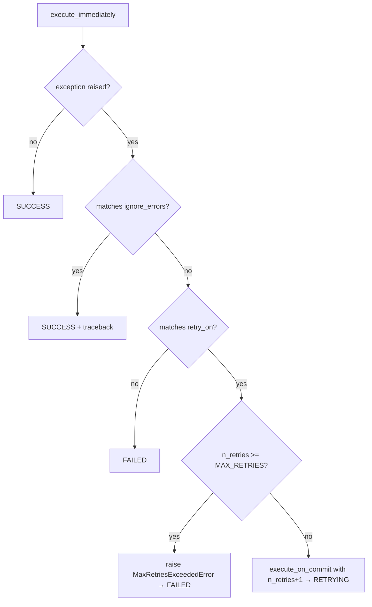

# Design Document: task-retry

## Overview

This feature adds automatic retry support to the `@lambda_task` decorator. When a task raises an exception whose type matches one of the types listed in `retry_on`, the executor re-enqueues the task via `execute_on_commit` with the same kwargs, a fresh `invocation_id`, and an incremented `n_retries` counter. Retries continue until the counter reaches `MAX_RETRIES`, at which point `MaxRetriesExceededError` is raised and the `TaskRecord` is marked `FAILED`.

The design follows the existing `ignore_errors` pattern closely: `retry_on` is validated at decoration time, stored on `LambdaTaskWrapper`, and read by the executor at execution time. It is never serialised into the SQS message.

---

## Architecture

The retry flow sits entirely within `SQSLambdaTaskMessage.execute_immediately()`, after the existing `ignore_errors` check and before the existing failure path. No new modules are required.



Key design decisions:

- `ignore_errors` is checked first. An exception type that appears in both `ignore_errors` and `retry_on` is treated as ignored (SUCCESS), not retried. This preserves the existing `ignore_errors` semantics and avoids ambiguity.
- `MaxRetriesExceededError` is raised (not swallowed), so it propagates to the Lambda handler and is reported as a `batchItemFailure`. This is intentional — the task has permanently failed and the operator should be alerted.
- The `RETRYING` status is a terminal status for the current invocation. The retry is a new invocation with a new `invocation_id`.

---

## Components and Interfaces

### `LambdaTaskWrapper` (`decorators.py`)

Add `retry_on` parameter alongside `ignore_errors`:

```python
def __init__(
    self,
    func: Callable[..., Any],
    *,
    delay: int = 0,
    soft_timeout: int | None = None,
    hard_timeout: int | None = None,
    queue: str = "default",
    ignore_errors: tuple[type[BaseException], ...] = (),
    retry_on: tuple[type[BaseException], ...] = (),
) -> None:
```

- `_validate_retry_on` is a static method mirroring `_validate_ignore_errors`.
- `retry_on` is exposed as a read-only property.
- The `lambda_task` decorator factory gains the same `retry_on` parameter and forwards it.
- At decoration time, after both `retry_on` and `ignore_errors` have been individually validated, a `_validate_no_overlap` static method checks every type in `retry_on` against every type in `ignore_errors` using `issubclass` in both directions. If any pair satisfies `issubclass(a, b) or issubclass(b, a)`, a `TypeError` is raised immediately identifying the conflicting types.

### `SQSLambdaTaskMessage` (`models.py`)

Add `n_retries` field:

```python
class SQSLambdaTaskMessage(BaseModel):
    task_name: str
    invocation_id: str
    kwargs: dict
    n_retries: int = Field(default=0, ge=0)
```

Pydantic's `ge=0` constraint rejects negative values with a `ValidationError`. The field uses `n_retries` as both the Python attribute name and the serialised JSON key.

### `MaxRetriesExceededError` (`models.py`)

A simple exception class defined at module level in `models.py` (no new file needed — it is tightly coupled to the executor logic):

```python
class MaxRetriesExceededError(Exception):
    def __init__(self, *, task_name: str, n_retries: int) -> None:
        super().__init__(
            f"Task '{task_name}' exceeded the maximum retry limit ({n_retries} retries)."
        )
```

### `LambdaTasksSettings` (`settings.py`)

Add `MAX_RETRIES` property:

```python
@property
def MAX_RETRIES(self) -> int:
    default = 2880  # 60 * 24 * 2
    val = self._get(name="LAMBDA_TASKS_MAX_RETRIES", default=default)
    if val is None:
        return default
    return int(val)
```

### Retry logic in `execute_immediately()` (`models.py`)

The exception handling block gains a retry branch between the `ignore_errors` check and the existing failure path:

```python
except Exception as error:
if wrapper.ignore_errors and isinstance(error, wrapper.ignore_errors):
    # existing ignore_errors path (unchanged)
    ...
elif wrapper.retry_on and isinstance(error, wrapper.retry_on):
    conf = LambdaTasksSettings()
    if self.n_retries >= conf.MAX_RETRIES:
        # record FAILED, then raise so the handler reports a batchItemFailure
        record.status = TaskRecord.TaskStatus.FAILED
        record.traceback = traceback.format_exc()
        record.end_time = now()
        record.save(update_fields=["status", "traceback", "end_time"])
        raise MaxRetriesExceededError(
            task_name=self.task_name, n_retries=self.n_retries
        )
    else:
        delay = wrapper._delay if wrapper._delay != 0 else max(1, round(random.uniform(0, 5)))
        wrapper.execute_on_commit(
            **self.kwargs,
            _delay=delay,
            _n_retries=self.n_retries + 1,
        )
        record.status = TaskRecord.TaskStatus.RETRYING
        record.traceback = traceback.format_exc()
        record.end_time = now()
        record.save(update_fields=["status", "traceback", "end_time"])
        return
else:
    # existing failure path (unchanged)
    ...
```

Note: `n_retries` must be passed through `execute_on_commit` → `_build_task` → `SQSLambdaTaskMessage`. The `_build_task` method already pops `_delay`; it must also pop `_n_retries` and pass it to the message constructor as `n_retries`.

---

## Data Models

### `TaskRecord` — new `RETRYING` status

```python
class Status(models.TextChoices):
    RUNNING = "RUNNING"
    SUCCESS = "SUCCESS"
    FAILED = "FAILED"
    RETRYING = "RETRYING"
```

The `max_length` on the `status` field must increase from `10` to `10` — `"RETRYING"` is 8 characters, so `max_length=10` is sufficient (no change needed).

The `CheckConstraint` must be updated to include `"RETRYING"`:

```python
models.CheckConstraint(
    condition=Q(status__in=["RUNNING", "SUCCESS", "FAILED", "RETRYING"]),
    name="taskrecord_status_valid",
)
```

A new migration (`0002_taskrecord_retrying_status.py`) is required to:
1. Alter the `status` field choices (Django records choices in migrations).
2. Drop and recreate the `CheckConstraint` with the updated `status__in` list.

### `SQSLambdaTaskMessage` — `n_retries` field

| Field | Type | Default | Constraint |
|---|---|---|---|
| `n_retries` | `int` | `0` | `>= 0` (Pydantic `ge=0`) |

The field is serialised as `"n_retries"` in the SQS message JSON. Existing messages without this field deserialise correctly because the default is `0`.

---

## Correctness Properties

*A property is a characteristic or behavior that should hold true across all valid executions of a system — essentially, a formal statement about what the system should do. Properties serve as the bridge between human-readable specifications and machine-verifiable correctness guarantees.*

### Property 1: `retry_on` accepts any tuple of BaseException subclasses

*For any* tuple of types that are all subclasses of `BaseException`, constructing a `LambdaTaskWrapper` with that tuple as `retry_on` should succeed without raising.

**Validates: Requirements 1.1**

### Property 2: Invalid `retry_on` raises `TypeError` at decoration time

*For any* value passed as `retry_on` that contains at least one element that is not a subclass of `BaseException` (e.g. a plain object, a string, an integer, or a non-exception class), constructing a `LambdaTaskWrapper` should raise `TypeError`.

**Validates: Requirements 1.3**

### Property 3: `n_retries` non-negative validation

*For any* negative integer `n`, constructing a `SQSLambdaTaskMessage` with `n_retries=n` should raise a Pydantic `ValidationError`; for any non-negative integer `n`, it should succeed.

**Validates: Requirements 2.3**

### Property 4: Retry increments `n_retries`

*For any* starting `n_retries` value `n` (where `n < MAX_RETRIES`) and any task that raises a `retry_on` exception, the `SQSLambdaTaskMessage` passed to `execute_on_commit` should have `n_retries == n + 1`.

**Validates: Requirements 2.2**

### Property 5: Matching exception enqueues retry with same kwargs and new `invocation_id`

*For any* task with a non-empty `retry_on` tuple, any kwargs dict, and any exception type in `retry_on`, when the task raises that exception and `_n_retries < MAX_RETRIES`, `execute_on_commit` should be called exactly once with kwargs equal to the original kwargs and an `invocation_id` different from the original.

**Validates: Requirements 3.1**

### Property 6: Retried task record has `RETRYING` status and non-null traceback

*For any* task that raises a `retry_on` exception and has `n_retries < MAX_RETRIES`, the `TaskRecord` for that invocation should have `status=RETRYING`, a non-null `traceback`, and a non-null `end_time`.

**Validates: Requirements 3.2**

### Property 7: Non-matching exception follows failure path with no retry enqueued

*For any* exception type that is not in `retry_on` (including the case where `retry_on` is empty), when the task raises that exception, `execute_on_commit` should not be called and the `TaskRecord` should have `status=FAILED`.

**Validates: Requirements 3.3, 3.4**

### Property 8: `n_retries >= MAX_RETRIES` raises `MaxRetriesExceededError` and records `FAILED`

*For any* `n_retries` value greater than or equal to `MAX_RETRIES`, when the task raises a `retry_on` exception, `MaxRetriesExceededError` should be raised, `execute_on_commit` should not be called, and the `TaskRecord` should have `status=FAILED` with a non-null traceback.

**Validates: Requirements 4.2, 4.4**

### Property 9: `MaxRetriesExceededError` message contains task name and retry count

*For any* task name string and any retry count integer, the `MaxRetriesExceededError` constructed with those values should have a message string that contains both the task name and the retry count.

**Validates: Requirements 4.3**

### Property 10: Non-zero wrapper delay is used as retry `_delay`

*For any* non-zero `delay` configured on the `LambdaTaskWrapper`, when a retry is enqueued, the `_delay` passed to `execute_on_commit` should equal the wrapper's `delay`.

**Validates: Requirements 5.1**

### Property 11: Zero wrapper delay produces retry `_delay` in `[1, 5]`

*For any* task with `delay=0` on the wrapper, when a retry is enqueued, the `_delay` passed to `execute_on_commit` should be an integer in the range `[1, 5]` inclusive.

**Validates: Requirements 5.2**

### Property 12: Overlapping `retry_on` and `ignore_errors` raises `TypeError` at decoration time

*For any* pair of exception type tuples where at least one type in `retry_on` is the same as, or a subclass of, a type in `ignore_errors` (or vice versa), constructing a `LambdaTaskWrapper` should raise `TypeError`.

**Validates: Requirements 1.5**

---

## Error Handling

- `MaxRetriesExceededError` is raised out of `execute_immediately()` after the `TaskRecord` is committed as `FAILED`. The Lambda handler catches it, logs it, and adds the SQS record to `batchItemFailures` — consistent with all other pre-task-logic failures.
- Negative `n_retries` in an incoming SQS message raises a Pydantic `ValidationError` during `model_validate_json`, which the handler also catches and reports as a `batchItemFailure`.
- If `execute_on_commit` itself raises (e.g. a misconfigured queue), the exception propagates out of `execute_immediately()` and is caught by the handler as a `batchItemFailure`. The `TaskRecord` will have been saved as `RETRYING` before the error, which is acceptable — the SQS message was not sent, so no retry will occur; the operator can inspect the record.

---

## Testing Strategy

### Unit tests (`tests/test_models.py` and `tests/test_decorators.py`)

- `retry_on` default is empty tuple (Requirement 1.2)
- `lambda_task` decorator forwards `retry_on` to `LambdaTaskWrapper` (Requirement 1.4)
- `LambdaTasksSettings.MAX_RETRIES` defaults to `2880` (Requirement 4.1)
- `LambdaTasksSettings.MAX_RETRIES` reads `LAMBDA_TASKS_MAX_RETRIES` from Django settings
- `RETRYING` is a valid `TaskRecord.Status` choice
- Regression guard: clean success path is unaffected by the new retry branch

### Property-based tests (Hypothesis, `tests/test_models.py` and `tests/test_decorators.py`)

Each property test runs a minimum of 100 iterations. Tests are tagged with:

> `Feature: task-retry, Property {N}: {property_text}`

| Property | Test location | Hypothesis strategy |
|---|---|---|
| P1: retry_on accepts valid tuples | `test_decorators.py` | `st.lists(st.sampled_from([ValueError, RuntimeError, ...]), min_size=0).map(tuple)` |
| P2: invalid retry_on raises TypeError | `test_decorators.py` | `st.one_of(st.integers(), st.text(), st.none(), ...)` |
| P3: n_retries non-negative | `test_models.py` | `st.integers(max_value=-1)` / `st.integers(min_value=0)` |
| P4: retry increments n_retries | `test_models.py` | `st.integers(min_value=0, max_value=MAX_RETRIES-1)` |
| P5: matching exc enqueues retry with same kwargs + new invocation_id | `test_models.py` | `st.fixed_dictionaries(...)` + `st.sampled_from(exc_types)` |
| P6: RETRYING status + traceback | `test_models.py` | `st.sampled_from(exc_types)` |
| P7: non-matching exc → FAILED, no retry | `test_models.py` | `st.sampled_from(non_retry_exc_types)` |
| P8: n_retries >= MAX_RETRIES → MaxRetriesExceededError + FAILED | `test_models.py` | `st.integers(min_value=MAX_RETRIES)` |
| P9: MaxRetriesExceededError message content | `test_models.py` | `st.text(min_size=1)` + `st.integers(min_value=0)` |
| P10: non-zero delay used as _delay | `test_models.py` | `st.integers(min_value=1, max_value=900)` |
| P11: zero delay → _delay in [1, 5] | `test_models.py` | fixed (delay=0, run 100 times) |
| P12: overlapping retry_on/ignore_errors raises TypeError | `test_decorators.py` | `st.lists(st.sampled_from([ValueError, RuntimeError, ...]), min_size=1).map(tuple)` for both, with guaranteed overlap |

**Dual testing approach**: unit tests cover specific examples, edge cases, and regression guards; property tests verify universal correctness across generated inputs. Both are required for comprehensive coverage.
